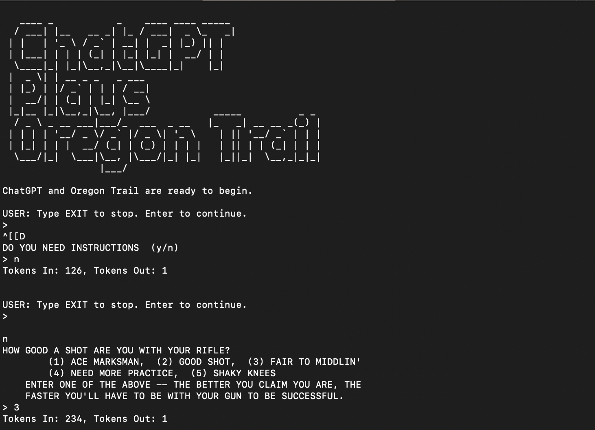
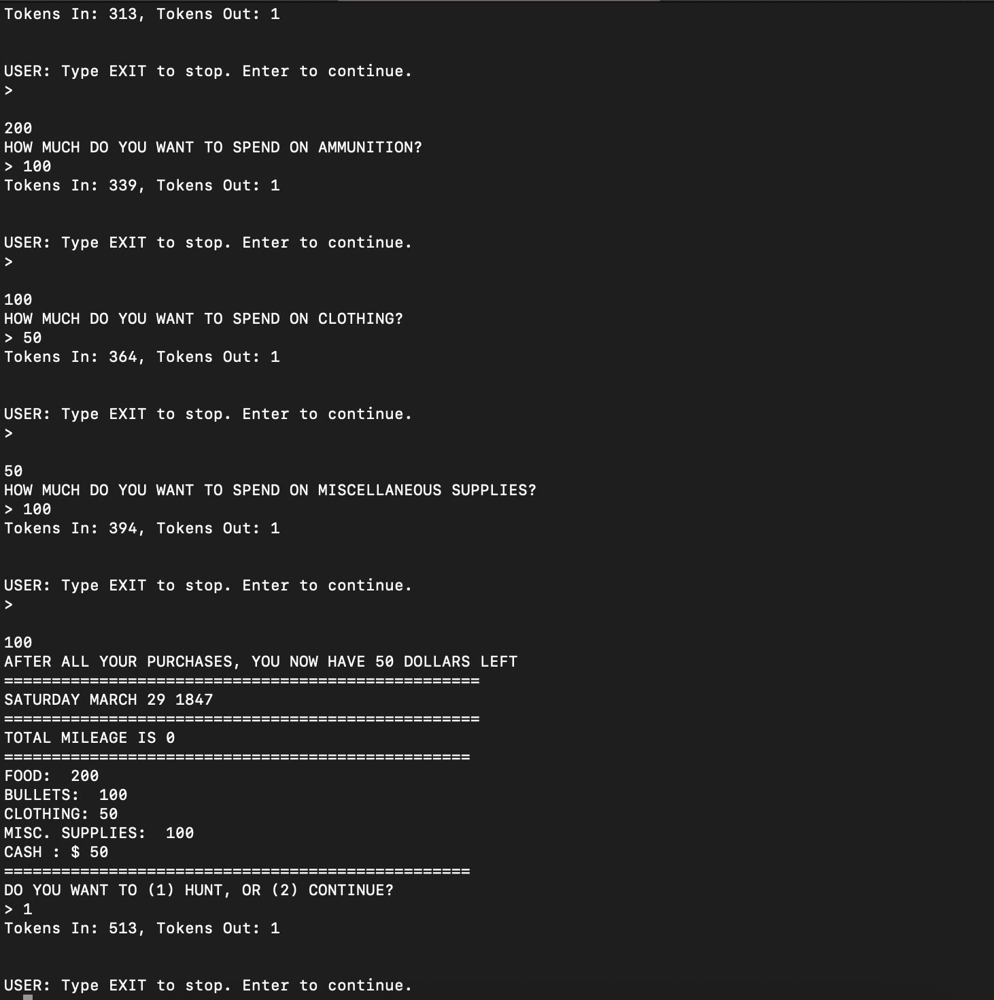
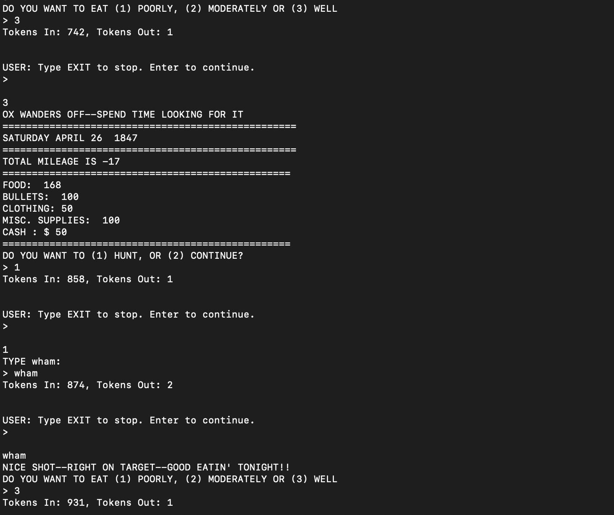
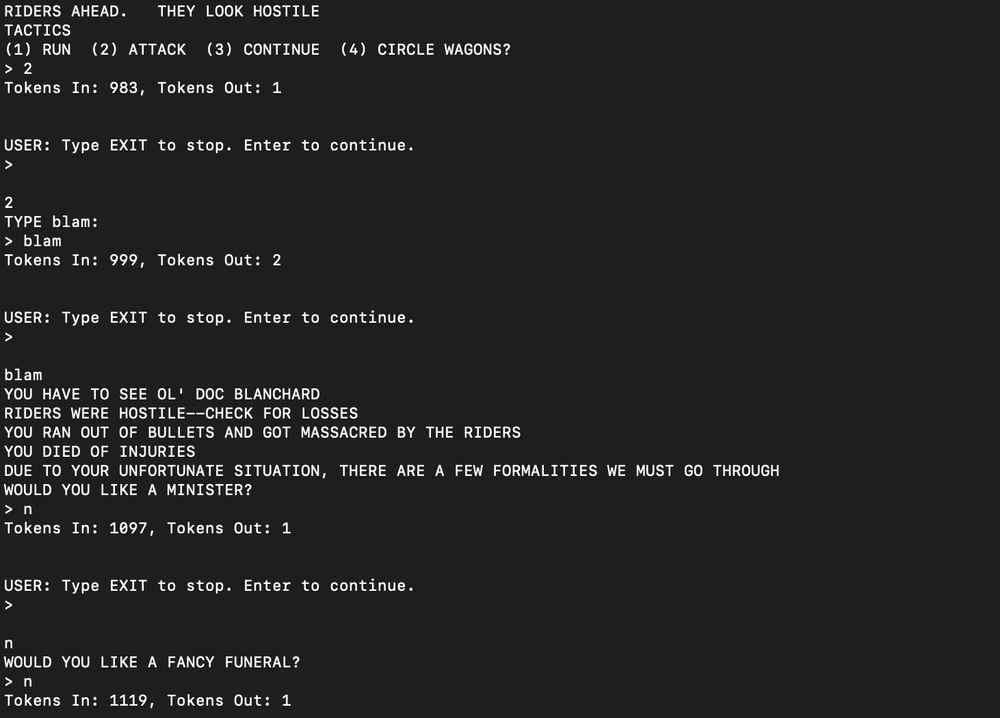

[](https://github.com/psf/black)
[](https://github.com/psf/black/blob/main/LICENSE)

# ChatGPT Plays Oregon Trail

```
   ____ _           _    ____ ____ _____                
  / ___| |__   __ _| |_ / ___|  _ \_   _|               
 | |   | '_ \ / _` | __| |  _| |_) || |                 
 | |___| | | | (_| | |_| |_| |  __/ | |                 
  \____|_| |_|\__,_|\__|\____|_|    |_|                 
 |  _ \| | __ _ _   _ ___                               
 | |_) | |/ _` | | | / __|                              
 |  __/| | (_| | |_| \__ \                              
 |_|__ |_|\__,_|\__, |___/           _____          _ _ 
  / _ \ _ __ ___|___/_  ___  _ __   |_   _| __ __ _(_) |
 | | | | '__/ _ \/ _` |/ _ \| '_ \    | || '__/ _` | | |
 | |_| | | |  __/ (_| | (_) | | | |   | || | | (_| | | |
  \___/|_|  \___|\__, |\___/|_| |_|   |_||_|  \__,_|_|_|
                 |___/                                  
``` 
##### ChatGPT attempts to play through the 1978 version of Oregon Trail.

## <sub> What is it?

* Another command line tool for the [OpenAI API - Docs](https://platform.openai.com/docs/introduction).
* Allows ChatGPT to play through the classic game [Oregon Trail (1978)](https://en.wikipedia.org/wiki/The_Oregon_Trail_(1971_video_game)).
* It will try its best to play through the game. You can continue or stop the game at each step in execution.

```
WARNING: This mode will let the AI play until the program terminates. Be ready to stop or kill the this process as necessary!

USER: Press ENTER to let ChatGPT play in UNLEASHED mode.
> 

   ____ _           _    ____ ____ _____                
  / ___| |__   __ _| |_ / ___|  _ \_   _|               
 | |   | '_ \ / _` | __| |  _| |_) || |                 
 | |___| | | | (_| | |_| |_| |  __/ | |                 
  \____|_| |_|\__,_|\__|\____|_|    |_|                 
 |  _ \| | __ _ _   _ ___                               
 | |_) | |/ _` | | | / __|                              
 |  __/| | (_| | |_| \__ \                              
 |_|__ |_|\__,_|\__, |___/           _____          _ _ 
  / _ \ _ __ ___|___/_  ___  _ __   |_   _| __ __ _(_) |
 | | | | '__/ _ \/ _` |/ _ \| '_ \    | || '__/ _` | | |
 | |_| | | |  __/ (_| | (_) | | | |   | || | | (_| | | |
  \___/|_|  \___|\__, |\___/|_| |_|   |_||_|  \__,_|_|_|
                 |___/                                  

ChatGPT and Oregon Trail are ready to begin.

DO YOU NEED INSTRUCTIONS  (y/n)
> n
Tokens In: 125, Tokens Out: 1


HOW GOOD A SHOT ARE YOU WITH YOUR RIFLE?
        (1) ACE MARKSMAN,  (2) GOOD SHOT,  (3) FAIR TO MIDDLIN'
        (4) NEED MORE PRACTICE,  (5) SHAKY KNEES
    ENTER ONE OF THE ABOVE -- THE BETTER YOU CLAIM YOU ARE, THE
    FASTER YOU'LL HAVE TO BE WITH YOUR GUN TO BE SUCCESSFUL.
> 2
Tokens In: 231, Tokens Out: 1


HOW MUCH DO YOU WANT TO SPEND ON YOUR OXEN TEAM ?
> 400
Tokens In: 255, Tokens Out: 1


TOO MUCH
HOW MUCH DO YOU WANT TO SPEND ON YOUR OXEN TEAM ?
> 200
Tokens In: 283, Tokens Out: 1


HOW MUCH DO YOU WANT TO SPEND ON FOOD? 
> 300
Tokens In: 304, Tokens Out: 1


HOW MUCH DO YOU WANT TO SPEND ON AMMUNITION? 
> 100
Tokens In: 328, Tokens Out: 1


HOW MUCH DO YOU WANT TO SPEND ON CLOTHING? 
> 100
Tokens In: 351, Tokens Out: 1


HOW MUCH DO YOU WANT TO SPEND ON MISCELLANEOUS SUPPLIES? 
> 100
Tokens In: 379, Tokens Out: 1


YOU OVERSPENT--YOU ONLY HAD $700 TO SPEND.  BUY AGAIN.
HOW MUCH DO YOU WANT TO SPEND ON YOUR OXEN TEAM ?
> 250
Tokens In: 422, Tokens Out: 1


HOW MUCH DO YOU WANT TO SPEND ON FOOD? 
> 250
Tokens In: 443, Tokens Out: 1


HOW MUCH DO YOU WANT TO SPEND ON AMMUNITION? 
> 100
Tokens In: 467, Tokens Out: 1


HOW MUCH DO YOU WANT TO SPEND ON CLOTHING? 
> 50
Tokens In: 490, Tokens Out: 1


HOW MUCH DO YOU WANT TO SPEND ON MISCELLANEOUS SUPPLIES? 
> 50
Tokens In: 518, Tokens Out: 1


AFTER ALL YOUR PURCHASES, YOU NOW HAVE 0 DOLLARS LEFT
==================================================
SATURDAY MARCH 29 1847
==================================================
TOTAL MILEAGE IS 0
=================================================
FOOD:  250
BULLETS:  100
CLOTHING: 50
MISC. SUPPLIES:  50
CASH : $ 0
=================================================
DO YOU WANT TO (1) HUNT, OR (2) CONTINUE? 
> 1
Tokens In: 635, Tokens Out: 1


TYPE blam: 
> blam
Tokens In: 649, Tokens Out: 2


RIGHT BETWEEN THE EYES---YOU OOT A BIG ONE!!!!
FULL BELLIES TONIGHT!
DO YOU WANT TO EAT (1) POORLY, (2) MODERATELY OR (3) WELL
> 2
Tokens In: 706, Tokens Out: 1


YOU KILLED A POISONOUS SNAKE AFTER IT BIT YOU
==================================================
SATURDAY APRIL 12  1847
==================================================
TOTAL MILEAGE IS -24
=================================================
FOOD:  287
BULLETS:  77
CLOTHING: 50
MISC. SUPPLIES:  45
CASH : $ 0
=================================================
DO YOU WANT TO (1) STOP AT THE NEXT FORT, (2) HUNT, OR (3) CONTINUE? 
> 2
Tokens In: 831, Tokens Out: 1


TYPE wham: 
> wham
Tokens In: 845, Tokens Out: 2


NICE SHOT--RIGHT ON TARGET--GOOD EATIN' TONIGHT!!
DO YOU WANT TO EAT (1) POORLY, (2) MODERATELY OR (3) WELL
> 3
Tokens In: 899, Tokens Out: 1


YOUR SON GETS LOST---SPEND HALF THE DAY LOOKING FOR HIM
==================================================
SATURDAY APRIL 26  1847
==================================================
TOTAL MILEAGE IS -57
=================================================
FOOD:  309
BULLETS:  63
CLOTHING: 50
MISC. SUPPLIES:  45
CASH : $ 0
=================================================
DO YOU WANT TO (1) HUNT, OR (2) CONTINUE? 
> 2
Tokens In: 1016, Tokens Out: 1


DO YOU WANT TO EAT (1) POORLY, (2) MODERATELY OR (3) WELL
> 2
Tokens In: 1050, Tokens Out: 1


UNSAFE WATER--LOSE TIME LOOKING FOR CLEAN SPRING
==================================================
SATURDAY MAY 10  1847
==================================================
TOTAL MILEAGE IS -44
=================================================
FOOD:  291
BULLETS:  63
CLOTHING: 50
MISC. SUPPLIES:  45
CASH : $ 0
=================================================
DO YOU WANT TO (1) STOP AT THE NEXT FORT, (2) HUNT, OR (3) CONTINUE? 
> 3
Tokens In: 1172, Tokens Out: 1


DO YOU WANT TO EAT (1) POORLY, (2) MODERATELY OR (3) WELL
> 1
Tokens In: 1206, Tokens Out: 1


HELPFUL INDIANS SHOW YOU WERE TO FIND MORE FOOD
==================================================
SATURDAY MAY 24  1847
==================================================
TOTAL MILEAGE IS -25
=================================================
FOOD:  292
BULLETS:  63
CLOTHING: 50
MISC. SUPPLIES:  45
CASH : $ 0
=================================================
DO YOU WANT TO (1) HUNT, OR (2) CONTINUE? 
> 2
Tokens In: 1319, Tokens Out: 1


DO YOU WANT TO EAT (1) POORLY, (2) MODERATELY OR (3) WELL
> 2
Tokens In: 1353, Tokens Out: 1


RIDERS AHEAD.   THEY DON'T LOOK HOSTILE
TACTICS
(1) RUN  (2) ATTACK  (3) CONTINUE  (4) CIRCLE WAGONS? 
> 3
Tokens In: 1405, Tokens Out: 1


RIDERS WERE FRIENDLY, BUT CHECK FOR POSSIBLE LOSSES
LOSE YOUR WAY IN HEAVY FOG---TIME IS LOST
==================================================
SATURDAY JUNE 7  1847
==================================================
TOTAL MILEAGE IS -17
=================================================
FOOD:  274
BULLETS:  63
CLOTHING: 50
MISC. SUPPLIES:  45
CASH : $ 0
=================================================
DO YOU WANT TO (1) STOP AT THE NEXT FORT, (2) HUNT, OR (3) CONTINUE? 
> 1
Tokens In: 1545, Tokens Out: 1


ENTER WHAT YOU WISH TO SPEND ON THE FOLLOWING: 
FOOD
> 200
Tokens In: 1570, Tokens Out: 1


YOU DON'T HAVE THAT MUCH--KEEP YOUR SPENDING DOWN
YOU MISS YOUR CHANCE TO SPEND ON THAT ITEM
AMMUNITION
> 50
Tokens In: 1608, Tokens Out: 1


YOU DON'T HAVE THAT MUCH--KEEP YOUR SPENDING DOWN
YOU MISS YOUR CHANCE TO SPEND ON THAT ITEM
CLOTHING
> 40
Tokens In: 1645, Tokens Out: 1


YOU DON'T HAVE THAT MUCH--KEEP YOUR SPENDING DOWN
YOU MISS YOUR CHANCE TO SPEND ON THAT ITEM
MISCELLANEOUS SUPPLIES
> 40
Tokens In: 1688, Tokens Out: 1


YOU DON'T HAVE THAT MUCH--KEEP YOUR SPENDING DOWN
YOU MISS YOUR CHANCE TO SPEND ON THAT ITEM
DO YOU WANT TO EAT (1) POORLY, (2) MODERATELY OR (3) WELL
> 1
Tokens In: 1747, Tokens Out: 1


UNSAFE WATER--LOSE TIME LOOKING FOR CLEAN SPRING
==================================================
SATURDAY JUNE 21  1847
==================================================
TOTAL MILEAGE IS -57
=================================================
FOOD:  261
BULLETS:  63
CLOTHING: 50
MISC. SUPPLIES:  45
CASH : $ 0
=================================================
DO YOU WANT TO (1) HUNT, OR (2) CONTINUE? 
> 2
Tokens In: 1860, Tokens Out: 1


DO YOU WANT TO EAT (1) POORLY, (2) MODERATELY OR (3) WELL
> 2
Tokens In: 1894, Tokens Out: 1


BAD LUCK--YOUR DAUGHTER BROKE HER ARM
YOU HAD TO STOP AND USE SUPPLIES TO MAKE A SLING
==================================================
SATURDAY JULY 5  1847
==================================================
TOTAL MILEAGE IS -48
=================================================
FOOD:  243
BULLETS:  63
CLOTHING: 50
MISC. SUPPLIES:  45
CASH : $ 0
=================================================
DO YOU WANT TO (1) STOP AT THE NEXT FORT, (2) HUNT, OR (3) CONTINUE? 
> 1
Tokens In: 2033, Tokens Out: 1


ENTER WHAT YOU WISH TO SPEND ON THE FOLLOWING: 
FOOD
> 150
Tokens In: 2058, Tokens Out: 1


YOU DON'T HAVE THAT MUCH--KEEP YOUR SPENDING DOWN
YOU MISS YOUR CHANCE TO SPEND ON THAT ITEM
AMMUNITION
> 30
Tokens In: 2096, Tokens Out: 1


YOU DON'T HAVE THAT MUCH--KEEP YOUR SPENDING DOWN
YOU MISS YOUR CHANCE TO SPEND ON THAT ITEM
CLOTHING
> 30
Tokens In: 2133, Tokens Out: 1


YOU DON'T HAVE THAT MUCH--KEEP YOUR SPENDING DOWN
YOU MISS YOUR CHANCE TO SPEND ON THAT ITEM
MISCELLANEOUS SUPPLIES
> 30
Tokens In: 2176, Tokens Out: 1


YOU DON'T HAVE THAT MUCH--KEEP YOUR SPENDING DOWN
YOU MISS YOUR CHANCE TO SPEND ON THAT ITEM
DO YOU WANT TO EAT (1) POORLY, (2) MODERATELY OR (3) WELL
> 1
Tokens In: 2235, Tokens Out: 1


RIDERS AHEAD.   THEY LOOK HOSTILE
TACTICS
(1) RUN  (2) ATTACK  (3) CONTINUE  (4) CIRCLE WAGONS? 
> 4
Tokens In: 2285, Tokens Out: 1


TYPE pow: 
> pow
Tokens In: 2298, Tokens Out: 1


KINDA SLOW WITH YOUR COLT .45
RIDERS WERE HOSTILE--CHECK FOR LOSSES
YOU RAN OUT OF BULLETS AND GOT MASSACRED BY THE RIDERS
DUE TO YOUR UNFORTUNATE SITUATION, THERE ARE A FEW FORMALITIES WE MUST GO THROUGH
WOULD YOU LIKE A MINISTER?
> no
Tokens In: 2384, Tokens Out: 1


WOULD YOU LIKE A FANCY FUNERAL?
> no
Tokens In: 2404, Tokens Out: 1


WOULD YOU LIKE US TO INFORM YOUR NEXT OF KIN?
> no
Tokens In: 2427, Tokens Out: 1


TERMINATE CONDITION HIT
```

## <sub> How to install.

* Install the latest version of [Python 3](https://www.python.org/downloads).
* Install the OpenAI [Python package](https://pypi.org/project/openai).
* Install [pexpect](https://pypi.org/project/pexpect) to control the Oregon Trail process. 
* Clone the repo.
* Oregon Trail can be installed in a number of ways and it depends on your system.
  * The original [BASIC source](https://archive.org/details/creativecomputing-1978-05/page/n143/mode/2up) was made public in 1978 and implementations of that can be found online ([example1](https://github.com/fortran-gaming/oregon-trail-1975), [example2](https://github.com/topherPedersen/OregonTrail1978)).
  * I found it easy to use [this Python 3 implementation](https://github.com/philjonas/oregon-trail-1978-python) of the code. Just install (download) the repo onto your system and then edit the config accordingly.
  * It is important that the version you choose runs in the terminal without any graphical interface. ChatGPT needs to be able to read the program's output after all.

## <sub> How to use.

* Add your OpenAI API key to <b>config.ini</b>.
* Ensure Oregon Trail command in <b>config.ini</b> is correct or update it for your specific install.
  * If Installed with the Python link from above it will work with the default (Just ensure the path is correct for your install location).
* python3 chatgpt_plays_ot.py
  * Run default application.
* python3 chatgpt_plays_ot.py -h
  * Display help message.
* python3 chatgpt_plays_ot.py -m "gpt-4"
  * Use model "gpt-4".
* python3 chatgpt_plays_ot.py -U
  * UNLEASHED mode. This lets ChatGPT play without user interaction until OT process terminates.

## <sub> Old images from testing





